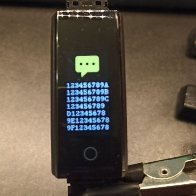

# cheap-band

REing cheap smart bands. Inspired by https://xor.co.za/post/2022-11-30-hacking-smartwatch/

## Supported bands

### B02 Band

Supported:

* text notifications with selectable app icon
* call start/end notification
* set band time
* find band
* get battery charge
* get steps count (draft)

### LT716 Watch

Supported:

* Vibration (find me)

Hardware:

* MCU: TLSR8232F512ET24

### Some URLs

* https://punchthrough.com/creating-a-ble-peripheral-with-bluez/
* https://habr.com/en/articles/340330/
* https://habr.com/en/articles/316462/
